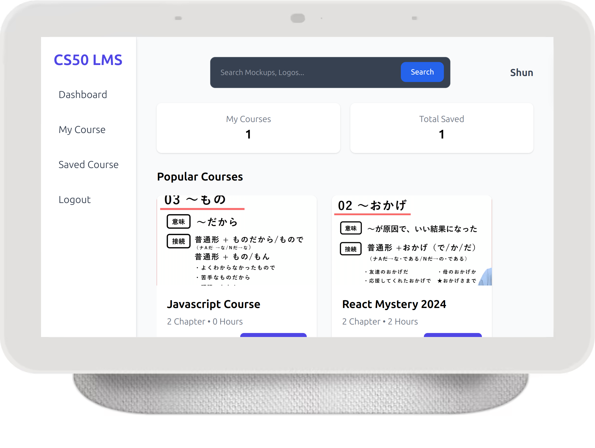

<h1>CS50 LMS</h1>

# Table of Contents
- [Introduction](#introduction)
   - [Installation](#installation)
   - [How CS50 LMS works](#how-cs50-lms-works)
- [Code and Organization](#code-and-organization)
   - [The CS50LMS Folder](#the-cs50lms-folder)
   - [The LMS Folder](#the-lms-folder)
   - [The Static Folder](#the-static-folder)
   - [Template Folder](#template-folder)
   - [manage.py](#manage-file)
   - [gitignore, requirements](#gitignore-requirements)
- [Database Design](#database-design)
- [Distinctiveness and Complexity](#distinctiveness-and-complexity)
- [Features](#features)
- [Third-Party Code](#third-party-code)
- [About and License](#about-and-license)
<br>

# Introduction
 CS50 LMS is a Learning Management System that supports two user types: **Teacher** and **Student**. Teachers can create courses, lectures, and quizzes, while students can browse and enroll in courses and complete quizzes. This LMS is built using Django (backend) and vanilla JavaScript (frontend).

## Installation

<details>
   <summary>1. Clone this repository</summary>

   > More information on how to clone this repository is available at https://docs.github.com/en/repositories/creating-and-managing-repositories/cloning-a-repository.
   > It is recommended that you set up a virtual environment. More information: https://packaging.python.org/en/latest/guides/installing-using-pip-and-virtual-environments/#:~:text=To%20create%20a%20virtual%20environment,virtualenv%20in%20the%20below%20commands.&text=The%20second%20argument%20is%20the,project%20and%20call%20it%20env%20.
   > Use the main branch, which is intended for local (production). The code from the deployment branch was modified for deployment.

</details>

<details>
   <summary>2. Install dependencies</summary>

   > ```bash
   > pip install -r requirements.txt
   > ```
   > If you make changes to the project, you can always update the requirements with:
   > ```bash
   > pip freeze > requirements.txt
   > ```

</details>

<details>
   <summary>3. Run Migrations for ORM</summary>

   > Open command prompt and run the following terminal commands:
   > ```bash
   > python manage.py makemigrations LMS
   > python manage.py migrate
   > ```

</details>

<details>
   <summary>4. Create a superuser and run the server</summary>

   > Create the superuser by typing the following in the terminal:
   > ```bash
   > python manage.py createsuperuser
   > ```
   > Set up a username, email, and password. Then start the server:
   > ```bash
   > python manage.py runserver
   > ```

</details>

Open up your browser to see the homepage and start exploring.



## How CS50 LMS Works

1. **(Teacher) Create Course**:
   - Teachers can create courses that contain lecture videos and quiz questions.
   - Teachers have access to a dashboard showing stats like the number of created courses, enrolled students, and popular courses.
   - They can create and manage course content (e.g., chapters, lectures, quizzes) without page reloads using AJAX.

2. **(Student) Enroll in Courses**:
   - Students can browse and enroll in courses of their choice.
   - Enrolled students can access all chapters and take quizzes to test their knowledge.
   - Students can save courses for later, even without enrolling.

Note: All actions (e.g., saving courses, adding chapters) are handled dynamically without reloading the page.

<br>

# Code and Organization
The CS50 LMS application has the following structure:
- The main Django folder: `CS50LMS`
- Application logic folder: `LMS`
- Frontend files folder: `static`
- Templates folder: `templates`

## The CS50LMS Folder
This is the standard Django application folder. Changes were made to `settings.py` to configure the database, installed apps, and middleware.

## The LMS Folder
- **`models.py`**: Contains Django ORM models like `User`, `Course`, `Chapter`, `Lecture`, and `Quiz`. Each model includes a `serialize` method for converting Python objects to JSON.
- **`urls.py`**: Handles routing logic for the application.
- **`views.py`**: Implements business logic for CRUD operations and communicates with the frontend via JSON responses.
- **`helperfunc.py`**: Includes utility functions for authentication and request validation.

## The Static Folder
This folder contains:
- **CSS** and **JS** files for the frontend, organized by template.
- Tailwind CSS for responsive design.
- Uploaded images and media for courses.

## Template Folder
Each route has its own HTML file in the `templates` folder. Shared templates like base layouts are also included.

## `manage.py`
This file is the entry point for running the Django application.

## `.gitignore` and `requirements.txt`
- **`.gitignore`**: Prevents unnecessary files (e.g., virtual environment folders) from being pushed to GitHub.
- **`requirements.txt`**: Lists dependencies needed to run the project.

<br>

# Database Design
The project uses Django ORM to manage the database. Here is the structure of the models:

- **`User`**: Stores user details (teachers and students).
- **`Course`**: Represents a course created by a teacher.
- **`Chapter`**: Links to a course and contains lectures and quizzes.
- **`Lecture`**: Stores video lectures and descriptions.
- **`Quiz`**: Contains multiple-choice questions for students.
- **`SavedCourse`**: Tracks courses saved by students for later.

### Example ERD (Entity-Relationship Diagram):
```plaintext
User
 |--< Course
       |--< Chapter
             |--< Lecture
             |--< Quiz
```

<br>

# Distinctiveness and Complexity

This project stands out because it is a full-fledged Learning Management System (LMS), distinct from projects in the course or submissions by other students. Here’s how it demonstrates distinctiveness and complexity:

1. **Distinctiveness:**
   - The project implements a complete LMS with multiple user roles (teachers and students), real-time interactivity using AJAX, and advanced UI/UX using TailwindCSS.
   - Features like chapter-based course creation, real-time quiz functionality, and a fully responsive design tailored for desktop and mobile users make it unique.

2. **Complexity:**
   - Uses multiple Django models with relationships (e.g., `User`, `Course`, `Chapter`, `Lecture`, `Quiz`).
   - AJAX is extensively used to perform CRUD operations (e.g., adding chapters, creating quizzes) without page reloads, enhancing user experience.
   - Email-based authentication is implemented to ensure security, going beyond Django’s default username-based authentication.
   - Optimized queries with Django ORM for efficient database handling.

<br>

# Features

- **Teacher Side:**
  - Create, edit, and manage courses.
  - Add chapters, lectures, and quizzes dynamically.
  - View course stats on the dashboard.

- **Student Side:**
  - Browse, enroll, and save courses.
  - Access lectures and quizzes.
  - Responsive interface with toast notifications.

- **General:**
  - Tailwind CSS for responsive design.
  - Real-time updates using AJAX.

<br>

# Third-Party Code
This project utilizes the following libraries and frameworks:
- **[TailwindCSS](https://tailwindcss.com/)**: For responsive design.
- **[Material Design for Bootstrap](https://mdbootstrap.com/)**: For form inputs.
- **[Toast notification with Progress Bar](https://codepen.io/alvarotrigo/pen/YzvKNvo)**: For notifications.
- **GFonts**: For typography.

<br>

# About and License
This project was submitted as the capstone project for CS50w from HarvardX. More information about the requirements is available at https://cs50.harvard.edu/web/2020/projects/final/capstone/.

This is a personal project completed by the author, which you are welcome to use and modify at your discretion. (MIT Licence)

If you liked this project, motivate the developer by giving it a :star: on GitHub!


